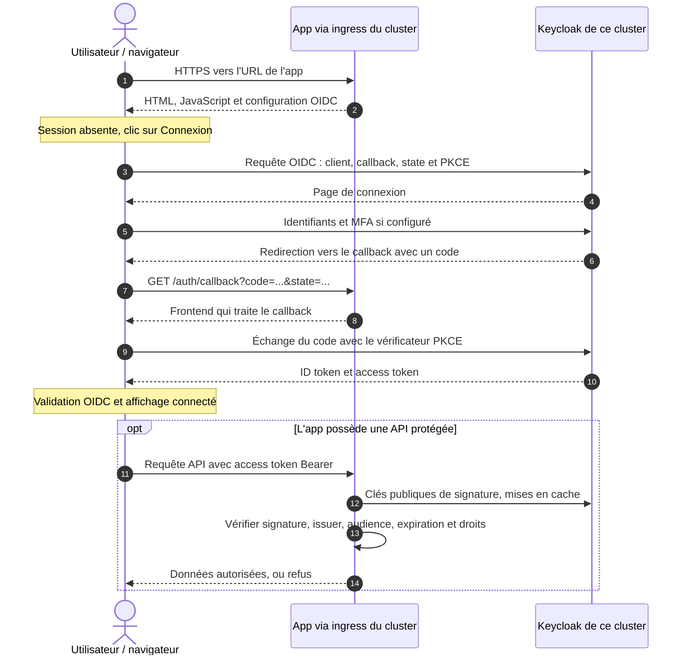

# Déployer Keycloak sur les clusters publics et privés et le raccorder à CNP

Date : 8 octobre 2026. Statut : conception proposée à la revue ; aucun déploiement livré par ce document.

Précision du 9 octobre : une app est déployée sur un seul cluster. Le multi-cloud permet de choisir son hébergement et n'a pas pour fonction de répliquer l'app ou son Keycloak pour assurer une résilience entre clouds.

## Résultat attendu

Une configuration versionnée par cible et une commande déploient Keycloak et le rendent utilisable par le provisioning CNP. Les clusters des clouds publics et privés utilisent le même chart Helm. AKS et le k3s privé sont les premières cibles concrètes, pas les deux seuls types de cluster possibles. Une nouvelle cible change ses paramètres d'infrastructure, sans réécrire les manifests communs ni modifier les templates applicatifs.

La commande configure aussi le client technique `cnp-provisioner`, conserve ses secrets dans Vault et enregistre l'instance auprès de CNP. L'opérateur n'a pas à recopier un secret dans un `.env`, à configurer chaque app ou à redémarrer le backend pour enregistrer une nouvelle instance.

Le choix proposé reste une instance partagée par cluster, avec un realm par app et environnement (`dev`, `prod`). Les apps n'ont pas à choisir une URL Keycloak : CNP déduit l'instance de leur cluster cible.

Réinstaller sur un cluster neuf recrée une installation utilisable. Retrouver les comptes et identités d'une installation perdue demande ses données sauvegardées ; l'automatisation de sauvegarde et de restauration est un chantier séparé. La création des clusters et de la plateforme CNP complète reste également hors périmètre.

## Points d'intégration existants

- `infra/keycloak/` contient déjà les ressources Keycloak, PostgreSQL et ingress, mais leur installation est manuelle et orientée AKS.
- [KeycloakService](../../../backend/services/keycloak_service.py) crée les realms et clients et écrit les variables OIDC dans Vault. Il utilise actuellement une configuration globale `KEYCLOAK_*`.
- Une app possède déjà `target_cluster_id`. La sélection de l'instance peut donc utiliser le choix de cluster existant, sans ajouter un choix dans les wizards de création.
- Les templates utilisent déjà le contrat `OIDC_ISSUER_URL`, `OIDC_CLIENT_ID` et, pour un client confidentiel, `OIDC_CLIENT_SECRET`. Leur livraison passe par Vault → ESO → Secret Kubernetes.
- Les dossiers GitOps `argocd/cnp-aks` et `argocd/cnp-k3s` existent dans `cnp-gitops`.
- Le backend tourne sur `cnp-control`, hors des clusters. Une URL Kubernetes `*.svc.cluster.local` n'est donc pas une URL admin utilisable directement par ce backend.

Les tests CI de la PR plateforme ont réussi ; ni l'installation du chart ni ce raccordement multi-instance ne sont validés sur les clusters à ce stade.

## Livraison proposée

| Élément | Fonction |
|---|---|
| `infra/keycloak/chart/` | Ressources communes : Keycloak en production, stockage dédié, services, ingress, probes et références aux secrets |
| Profils public et privé, avec valeurs propres à chaque cluster | Adresse OIDC, accès admin privé, IngressClass, TLS, StorageClass, ressources et nom logique d'instance |
| Commande de déploiement | Vérifier les prérequis, déployer, attendre la disponibilité, effectuer le bootstrap et enregistrer l'instance dans CNP |
| Applications ArgoCD | Utiliser le même chart et les mêmes valeurs dans les arborescences GitOps actuelles |
| Adaptation CNP ciblée | Résoudre l'instance depuis le cluster, conserver l'association de l'app et afficher l'instance dans le statut existant |

Exemple d'interface à livrer, et non commande disponible aujourd'hui :

```bash
./infra/keycloak/deploy.sh --config infra/keycloak/targets/public-aks.yaml
./infra/keycloak/deploy.sh --config infra/keycloak/targets/private-k3s.yaml
```

Chaque fichier cible identifie explicitement son contexte Kubernetes, son cluster CNP, son namespace, sa release et son mode de gestion (`helm` ou `argocd`). La commande ne s'appuie pas sur le contexte Kubernetes courant implicite. Elle ne gère pas la même release simultanément avec Helm direct et ArgoCD.

En mode Helm, elle installe ou met à jour le chart. En mode ArgoCD, elle synchronise l'Application configurée puis attend sa disponibilité. Les Applications proposées dans `cnp-gitops` fixent la révision Git du chart et des valeurs ; publier un nouveau registre OCI n'est pas nécessaire pour cette première livraison. L'accès ArgoCD au dépôt du chart est un prérequis configuré avec les credentials de lecture existants ou fournis à l'installation.

Le chart inclut la base persistante nécessaire à Keycloak ; l'opérateur n'effectue pas une installation de base séparée. La première version utilise un replica Keycloak et PostgreSQL dédié avec PVC. Aucune infrastructure HA, base externe optionnelle ou Keycloak Operator n'est ajoutée.

### Classification des cibles

« Public » et « privé » décrivent le cloud d'hébergement ; « AKS » et « k3s » décrivent une offre ou distribution Kubernetes. Ces deux dimensions ne sont pas confondues. Le chart ne contient aucune branche métier `si AKS / sinon k3s`. Des valeurs par cluster fournissent ses capacités réelles, et le backend utilise son identifiant CNP. Plusieurs clusters publics ou privés peuvent chacun avoir leur propre Keycloak.

La qualification d'un cloud comme privé ne rend pas automatiquement l'URL OIDC privée. Sa visibilité dépend des utilisateurs et des apps qui doivent la joindre. Les StorageClass et paramètres ingress restent spécifiques au cluster : `local-path` est un choix pour le k3s actuel, pas une propriété de tous les clouds privés.

## Raccordement automatique à CNP

### Configuration de l'instance

Un petit registre interne CNP conserve : clé logique stable, cluster cible par défaut, URL publique, URL admin privée, identifiant du client technique, référence Vault de son secret et état d'activation. Un endpoint administrateur idempotent permet à la commande de déploiement d'enregistrer cette configuration. Il vérifie le client technique depuis le backend avant d'activer l'instance et journalise l'opération sans exposer les credentials.

La commande reçoit l'URL CNP et une authentification administrateur CNP par l'environnement, en réutilisant l'authentification API existante. Elle écrit d'abord le secret du client dans Vault, puis transmet uniquement sa référence à CNP. La configuration est lue par le service au moment de ses opérations : enregistrer une instance ne nécessite pas de recharger la configuration globale du processus.

Le client `cnp-provisioner` et ses droits sont réconciliés par le bootstrap. Une seconde exécution conserve les comptes, clients, secrets et données existants. Un échec d'enregistrement ne supprime pas la release ; une relance termine le raccordement. Il n'y a pas de rotation implicite des mots de passe ou secrets à chaque déploiement ou synchronisation ArgoCD.

### Sélection et association des apps

Lors d'une première activation, CNP utilise l'instance active associée à `target_cluster_id` et persiste une association `auth_instance_key` avant les mutations Keycloak. L'association s'applique aux deux environnements. Statut, provisioning, retry, console, révocation des membres GitLab et suppression utilisent tous cette même instance et son URL publique.

Une instance indisponible ne fait pas basculer l'app sur l'autre cluster. Le provisioning reste best-effort comme aujourd'hui : l'app créée demeure enregistrée avec un échec d'auth identifiable et une possibilité de retry.

Changer le cluster d'hébergement d'une app ne migre pas ses identités et ne change pas son issuer. L'association est conservée et visible dans les écrans et commandes de statut actuels. Aucun écran supplémentaire de configuration Keycloak n'est imposé aux équipes ; les modifications nécessaires des contrats sont propagées dans `shared`, le frontend et la CLI.

La clé logique et l'URL publique d'une instance liée à des apps restent stables. L'URL admin et son hébergement peuvent être actualisés. Une instance liée ne peut pas être supprimée ; la suppression d'une connexion de cluster ne supprime ni l'instance ni les identités. Une réinstallation avec une base vide ne répare pas silencieusement les realms manquants d'apps déjà provisionnées.

### Compatibilité avec la configuration actuelle

Les paramètres globaux `KEYCLOAK_*` continuent de fonctionner pour la configuration historique et locale. La migration de schéma n'active aucun service et ne recrée aucun realm.

Les apps déjà activées sans association explicite restent sur l'instance globale historique, même si une nouvelle instance est enregistrée pour leur cluster. Les nouvelles activations choisissent l'instance du cluster lorsqu'elle existe ; sinon elles conservent le comportement historique si celui-ci est configuré. Une fois liée à une instance explicite, une app n'utilise jamais ce repli historique.

Une instance enregistrée et activée peut être utilisée sans modifier le flag global destiné à l'installation historique. Les contrôles du service et de la synchronisation GitLab doivent donc vérifier la disponibilité de l'instance de l'app, et pas seulement `KEYCLOAK_ENABLED`.

### Ce que signifie « sans travail supplémentaire »

Pour une app issue des templates compatibles, aucun nouveau travail de raccordement à Keycloak n'est attendu : les realms, clients et variables restent provisionnés via le contrat existant. Ce déploiement ne modifie pas les routes que l'app choisit de protéger.

Pour une app onboardée, CNP fournit la même configuration sans injecter du code dans son dépôt. L'app doit déjà implémenter OIDC et son chart consommer le Secret d'environnement. L'avertissement existant sur `envFrom` est conservé. On ne promet pas de transformer automatiquement une app arbitraire en app authentifiée.

## Secrets et paramètres d'infrastructure

Les valeurs versionnées contiennent des références, jamais les secrets. Les credentials de base et de bootstrap sont créés une seule fois et conservés dans Vault sous `secret/cnp/keycloak/{instance_key}/`. Le secret de provisioning est réservé au backend.

ESO utilise une identité et un SecretStore limités aux secrets nécessaires au namespace Keycloak. La politique applicative actuelle, limitée à `secret/apps/*`, n'est pas élargie. La livraison inclut les politiques et la procédure d'amorçage de cette identité d'infrastructure, ainsi que les droits backend nécessaires. Les credentials d'installation sont fournis par l'environnement et ne figurent pas dans Git ou les logs.

Les différences entre AKS et k3s sont explicites : StorageClass, ressources, ingress et connectivité. Les images sont fixées et compatibles AMD64 et ARM64. Les PVC ne sont pas supprimés par une désinstallation ou un prune ArgoCD ordinaire.

L'URL publique doit être accessible depuis les navigateurs et les pods qui utilisent OIDC. L'URL admin privée doit être accessible depuis `cnp-control` par le réseau Tailscale actuel ; la configuration évite une ClusterIP codée en dur. Le déploiement vérifie cette accessibilité depuis CNP, pas seulement depuis un pod Keycloak.

### Domaine commun à plusieurs instances

Une instance par cluster n'impose pas un domaine par cloud. Un domaine commun, par exemple `auth.cloud-native-plat4k.me`, peut exposer plusieurs instances si une passerelle route systématiquement chaque requête vers la bonne instance. Deux adresses DNS vers deux instances indépendantes ne constituent pas ce routage : le navigateur contacte le domaine d'authentification indépendamment du domaine de l'app.

La variante proposée pour un domaine commun utilise un préfixe stable par instance, par exemple `/clusters/public-01` et `/clusters/private-01`. Chaque Keycloak déclare ce chemin dans son hostname et/ou son contexte HTTP, conformément à la [configuration officielle du proxy](https://www.keycloak.org/server/reverseproxy). La passerelle n'a qu'une route par instance. L'issuer injecté dans l'app contient ce préfixe, suivi de `/realms/{app}-{env}`. Les templates conservent leur contrat de variables OIDC.

Une autre variante conserve une base identique sans préfixe et route `/realms/{app}-{env}/...` vers le cluster propriétaire. Les slugs d'app sont déjà uniques dans CNP, mais cette variante ajoute une table de routage par realm à réconcilier pendant le provisioning et la suppression. Les ressources de connexion, les consoles et autres chemins Keycloak doivent aussi être servis correctement. Elle ne consiste donc pas à installer le même ingress dans chaque cluster. Le choix d'une passerelle et de cette variante reste une proposition de conception, sans composant de routage livré à ce stade.

Dans les deux variantes, l'Admin API utilisée par CNP conserve un accès privé distinct par instance. Le même domaine public ne supprime pas la nécessité de choisir le Keycloak du cluster pour créer un realm. Aucun basculement automatique vers un autre Keycloak n'est prévu.

Keycloak utilise `start`, un hostname explicite et les proxy headers appropriés. L'ingress est HTTPS avec une chaîne TLS valide ; le port de management et `master` ne sont pas exposés publiquement. La console des realms applicatifs reste utilisable. Voir les recommandations officielles de [configuration](https://www.keycloak.org/server/configuration) et de [reverse proxy](https://www.keycloak.org/server/reverseproxy).

DNS, certificat, accès Kubernetes, Vault, ESO et réseau privé restent des paramètres ou prérequis d'infrastructure. La commande les contrôle et signale précisément un manque. Elle ne prétend pas créer un cloud vierge avec seulement les manifests Keycloak.

## Vérifications requises

1. Rendre et valider les deux profils ; vérifier les ressources persistantes, les références de secrets, les images multi-architecture et les manifests ArgoCD.
2. Tester le bootstrap deux fois sur un vrai Keycloak : client utilisable, droits corrects et secret inchangé ; tester la reprise après un échec partiel.
3. Tester le routage CNP pour AKS et k3s, la compatibilité globale, les retries, les conflits de propriété et la révocation GitLab, sans fuite entre instances.
4. Tester une app template et une app onboardée compatible : variables injectées, issuer correct, authentification et accès console effectifs.
5. Effectuer les essais sur les deux clusters pour valider le stockage, HTTPS, Vault et l'accès privé depuis le backend. Un rendu Helm ou une CI réussie ne remplace pas ces essais.

La correction du profil Docker Compose fait partie de cette livraison : le déploiement de production actuel ne doit plus démarrer le Keycloak local en `start-dev` avec ses identifiants par défaut. Ce point doit être résolu avant une fusion qui déclenche la pipeline de déploiement.

## Parcours d'un utilisateur

Avant la visite, CNP a créé le realm et le client dans le Keycloak du cluster de l'app et injecté la configuration par Vault → ESO → Secret → app. CNP ne relaie pas les identifiants ou les connexions ordinaires des utilisateurs.

Ce schéma décrit une app web utilisant Authorization Code + PKCE, comme le template React actuel. Une éventuelle API appartient au même contrat OIDC et vérifie le token avant de retourner ses données protégées.



Avec un domaine d'auth commun, la passerelle envoie les requêtes vers `K` en utilisant le préfixe d'instance ou la route de realm. Un autre cluster ne doit pas recevoir l'échange du code ou la récupération des clés.

Les templates actuels illustrent ce raccordement sans protéger automatiquement toutes les pages : React propose un bouton de connexion ; les templates API protègent notamment `/me`, tandis que `/` et `/health` restent publics. Une API seule répond `401` à une requête sans token sur une route protégée, sans afficher automatiquement une page de connexion. L'autorisation des fonctionnalités reste définie par l'app.

## Limite de cette conception

Le chart commun, la commande et l'adaptation multi-instance décrits ici sont à implémenter. Ce document précise le résultat à livrer et ne déclare ni l'intégration ni les déploiements opérationnels.
